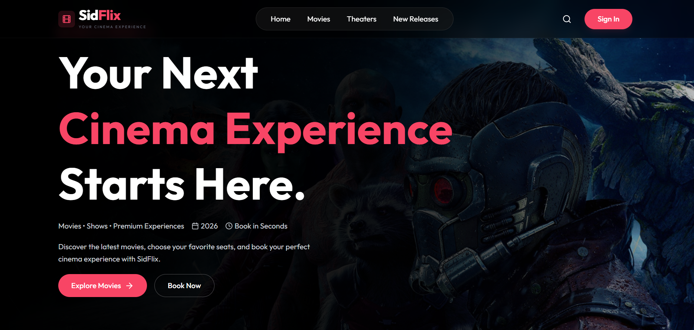
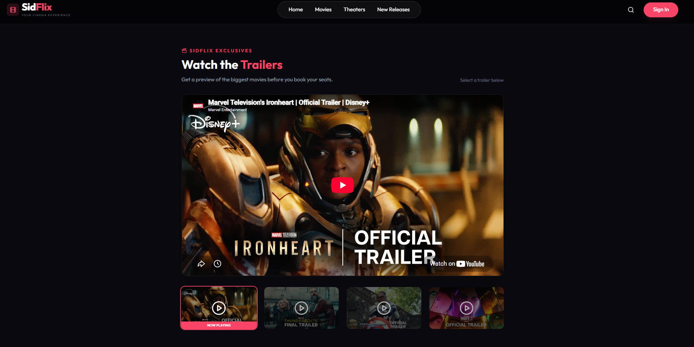
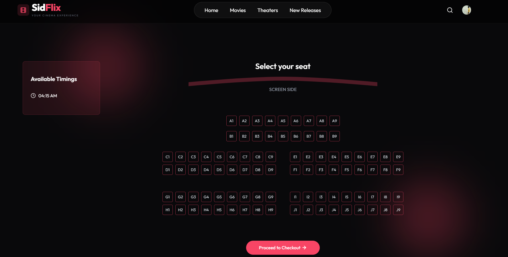

# 🎬 SidFlix

<p align="center">
  <strong>A Modern Cinema Ticket Booking Platform</strong>
</p>

<p align="center">
  Discover movies, watch trailers, explore theaters, select your seats, and enjoy a seamless movie booking experience.
</p>

<p align="center">
  <a href="https://sid-flix-unthinkable-solutions.vercel.app">
    
  </a>
</p>

---

## 🚀 Live Demo

🌐 **Frontend:**  
https://sid-flix-unthinkable-solutions.vercel.app

---

# 📸 Project Preview

<p align="center">
  
</p>

### 🏠 Modern Cinema Experience

SidFlix provides a modern and visually engaging homepage where users can discover movies and start their cinema booking journey.

---

<p align="center">
  
</p>

### 🎬 Watch Movie Trailers

Users can explore and watch trailers of upcoming and popular movies directly through the platform.

---

<p align="center">
  
</p>

### 💺 Interactive Seat Selection

Users can select their preferred seats through an interactive cinema seat layout before proceeding to checkout.

---

# ✨ Features

- 🎥 Browse and explore movies
- 🔍 Search for movies
- 🎬 Watch movie trailers
- 🏢 Explore available theaters
- 🕒 View available show timings
- 💺 Interactive seat selection
- 🎟️ Movie ticket booking experience
- 🔐 User authentication with Clerk
- 👤 User profile management
- 🛠️ Admin functionality
- 📱 Responsive modern user interface
- 🌐 API-powered movie data using TMDB

---

# 🛠️ Tech Stack

### Frontend

- React.js
- Vite
- JavaScript
- CSS
- Axios

### Backend

- Node.js
- Express.js

### Database

- MongoDB

### Authentication

- Clerk

### External API

- TMDB API

### Deployment

- Vercel

---

# 📂 Project Structure

```text
SidFlix/
│
├── assets/
│   ├── Homepage.png
│   ├── Trailers.png
│   └── SeatSelection.png
│
├── client/                 # React + Vite Frontend
│
├── server/                 # Node.js + Express Backend
│
└── README.md
